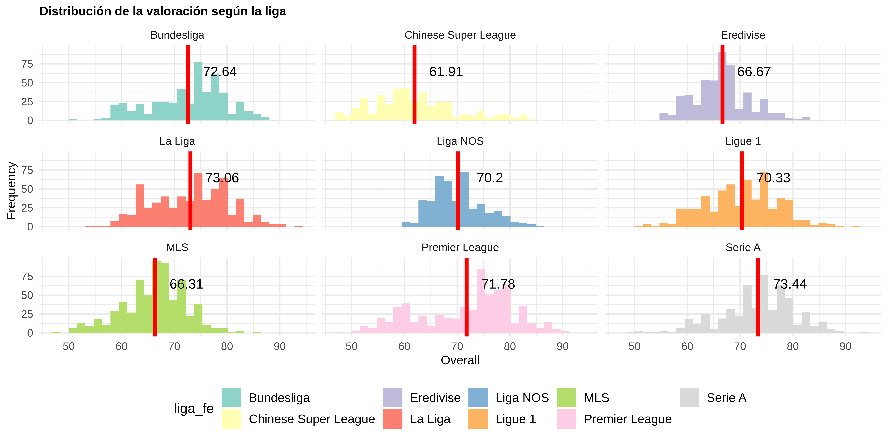

# Soccer Analytics: The value of data in soccer

In this repository, you will find the code that I used to develop my final thesis in my Master in Big Data and Business Analytics @ the Complutense University of Madrid.

The goal of this project was to use soccer data related to 18.000 players that let us:
* Understand variables in the dataset
* Study relationship among variables
* Create a Recommender Player System based on playing style
* Develop two ML models

Also, you can find the 'Futbolytics' tool with the Recommender Player System and the Price Prediction Model Deployment [here](https://futbolytics-st.herokuapp.com/)

---
## Exploratory Data Analysis: Understanding the variables in the dataset
In this section, we focused on understanding the variables and the relationship among them.

### Where do the players come from?

It's interesting to see that most of the players come from UK, Germany (Among others EU countries), and South America... but are they the best players?

We can see that having a small number of players is not related to those players being worse (Take a look at Africa in both images, for example.)

### What happens with the player's Age?
Once we know that the player's origin is not a factor that indicates where the best players are, we can focus on other variables such as their age. As soccer is a physical sport, it is normal that older players have less overall (score between 0 and 100 indicating how good a player is). And if we include in the analysis the position of each player...

We can appreciate in the graph that from age of 40 the only players who are still active are goalkeepers because they require less physical effort. 

Focusing on the player's age we can have doubts about the leagues that are in the dataset (La Liga, Premier League, Bundesliga, Serie A, Eredivisie, Liga NOS, MLS and Chinese Superleague)

We the chart above we can conclude that if we are playing soccer and we are in the final stages of our careers, we should focus on finding a team in China or MLS instead of other leagues that have the average age younger such as the Premier League. The reason for this is because the fact that having a younger average could indicate that the league is more competitive than others.

We can confirm that the best players are playing in the EU leagues such as PL (England), La Liga (Spain) or Bundesliga (Germany).

### What happens with the player's position?
The position_fe indicates if the position of the player (delantero, mediocentro, defensa y portero : striker, midfielder, defender and goalkeeper). We can think that playing in one position or another could indicate different abilities...

And that's true!! The top 5 abilities required for playing as a midfielder are not the same as a striker, for example.

## Similar players
### Clustering 
In this section, we focused on finding out how we could group players by similar abilities.

And, as we can see above, we were able to separate players in their position based on their variables which indicates that we could do further analysis and find more sub-clusters.

### Recommender Player System
However, what would be interesting is to create a formula to obtain a top X list of similar players to another one. This would let the teams find out what is the best player to replace another player

## ML models
### Price Prediction
Focusing on supervised learning, we create a model that based on several variables, can predict the player's value in the market (in €). This model will let the teams, not only predict a player's value from his team but also know the player's value from another team, maximizing revenues and minimizing expenses.

### Best Position Prediction
Also, it is interesting based on the player's abilities to find out what is his best position on the field. To do so, we developed a multiclass logistic regression.

## Streamlit
Finally, we developed a tool to let us interact with the Recommender Player system and the Price Prediction Model. You can find the page [here](https://share.streamlit.io/jignaciofvm/fifa-20-dataset-analysis/main/FIFA_20_Analysis.py)
